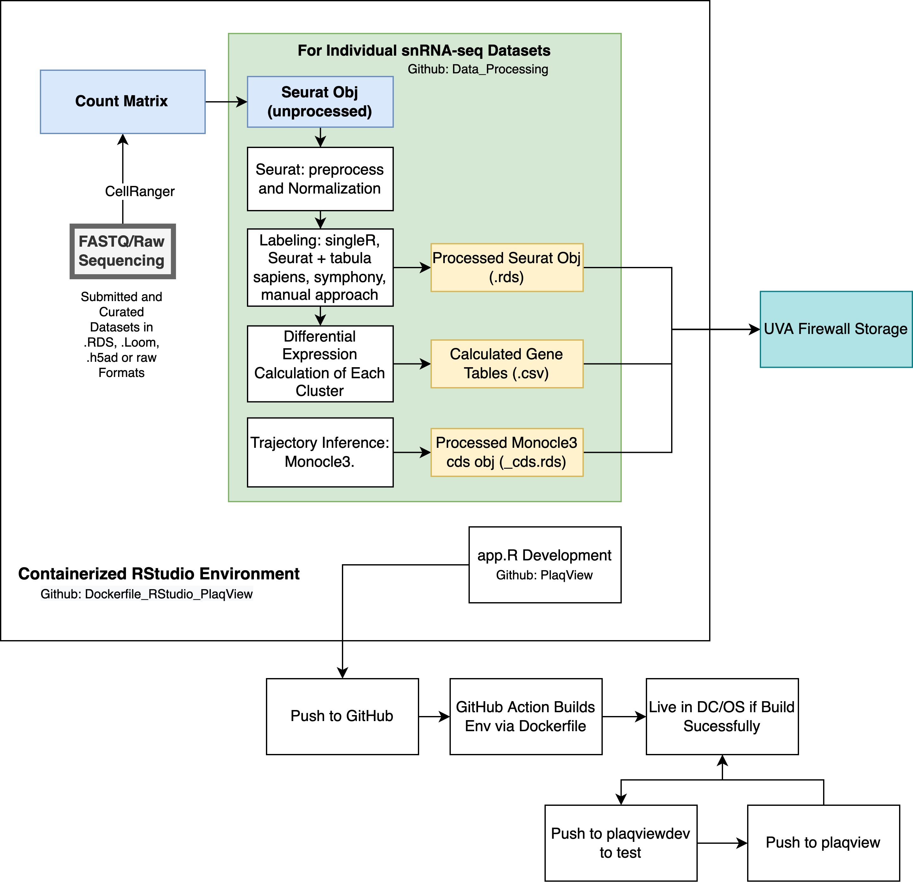

# PlaqView_DataProcessing
 This is just the directory and scripts for processing the raw recruited datasets

 Please contact us at weima@virginia.edu to submit your data and arrange for transfer! We look forward to showcasing your data on our app.

 # PlaqView Data Processing Steps

 Wei Feng Ma, MSTP UVA. Miller Lab.

 ## Gathering Data
 Currently, we do not have a standard way to deposit and retrieve datasets. Therefore, custom reformatting of each dataset that comes through is required.

 For example, Wirka et al., deposited their data in GEO as .txt matrix files that contains all the samples mixed together, whereas Pan et al., had their dataset separated by sample and had to be integrated.

 To organize each dataset, the master excel file is edited in the PlaqView directory('Available_dataset.xlsx'). Then, the custom 'DataID' field is used to create a subfolder in the 'data' directory.

 The raw input data is not stored within PlaqView project folder, but separately. The preocessed .rds is deposited in the 'data' subdirectory to allow PlaqView to retrieve it.

 ## Inputing Data
 From GEO/Text: copy and run the 'PlaqView_to_seurat_from_GEO.R'.

 From Seurat:
 Copy and run "PlaqView_preprocessing_master_HUMAN_05-04-2021.R"
 Note that this is continuously being updated so please refer to the closest available .r processing file on GitHub!

 *IMPORTANT*
 1) use dockerized rstudio session for reproducible environment and guarantee package install. See: https://github.com/MillerLab-CPHG/Dockerfile_Plaqview
 2) make sure author-provided labels are under metadata "Author_Provided".

